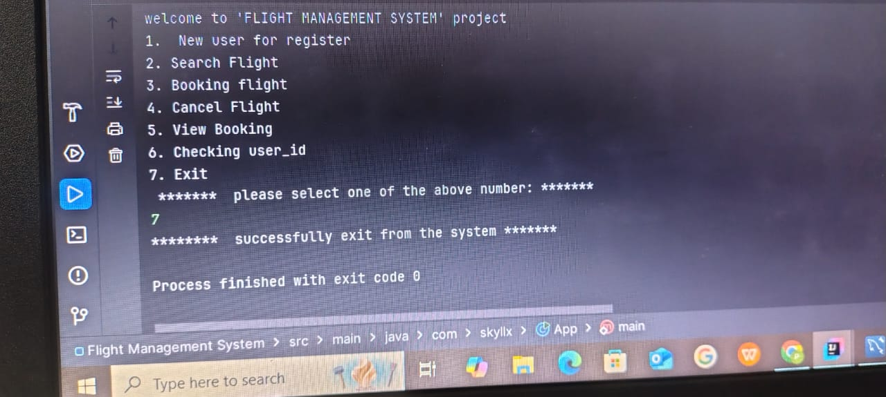

# Flight-Management-System
📋 Project Description
The Flight Management System is a Java-based application that allows users to register, searching for flights, 
booking of  tickets, cancel bookings, and view their reservations. It uses JDBC to connect to a MySQL database, 
managing all flight and user data efficiently.

🛠️ Technologies Used
- Java (Core Java)
- JDBC (Java Database Connectivity)
- MySQL Database
- intellij
- Git & GitHub

📚 Features
- ## User Registration:
   - it's help a new user to register data in to a system
  - when user type the 1 number it will show the following result.
  
  
- ## Check User ID existence:
 -  This is helpful for existing user and new user to check there unique id
  
  
  ## if user giving a wrong email or  number then it shows this type of error
   
  
- ## Flight Search based on departure and destination:
    - it  is basicaly contain flight detiles suh as flight_id, departure,destination, no_of_seats, price.
    
  ## after booking the flight it will decrese the no-of_seats.
   
  ## after cancel the flight it will increse the no_of_seats.
   
  
- ## Flight Booking for registered users:
 -  based on the user id and flight id we booking the flight
    
  
- ## Cancel Flight Booking:
  - if we want to be canceled the booking then it takes the booking id. it results  to change the no_of_seatsin flight table and booking table status  must be changed to canceled
    
  
- ## View Bookings made by the user:
  ## status: conformed
    
  ## after cancel the flight the status will be changed to canceld
   
  
- ## Exit Application:
  - if we want exit from the system then it shows below message. it's basicaly very importance bec in that we closing all the connection which are established in the above tasks.
    

🗄️ Database Structure
- users table: Stores user details (user_id, name, email, number)

- flights table: Stores flight details (flight_id, departure, destination, date, no_of_seats,price)

- booking table: Stores booking records (booking_id, user_id, flight_id, seat_number,status)

🚀 How to Run
- Clone the repository:
- git clone https://github.com/prasadsomnath/Flight-Management-System.git

## Set up the MySQL database:
create database with name my_db.
Create the required tables (users, flights, booking).
Update your database credentials in the Java code.

## Compile and run the project:
javac app.java
java Main

📂 Project Structur:

- Flight-Management-System
  -  ├── src/
    -      └── Main
      -         └── java
        -             └── com.skyllx(package)
          -                   └──app.java
├── README.md
└── schema.sql 

📢 Notes:
- Ensure you have MySQL server running before executing the application.
- JDBC Driver (Connector/J) must be configured in your project setup.

📄 License :
This project is for educational purposes only.
